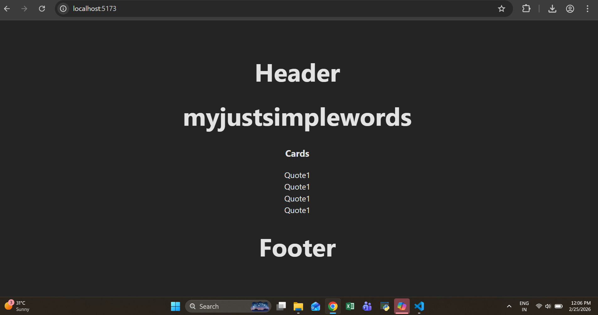
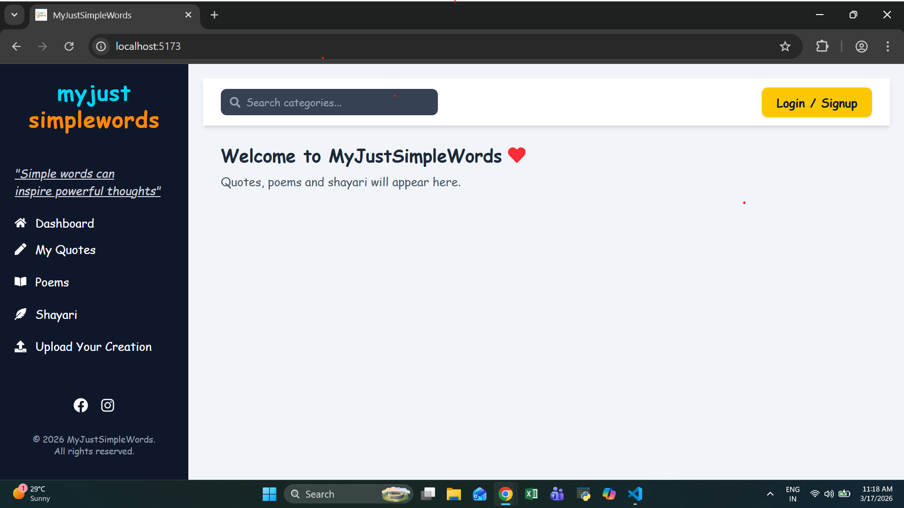
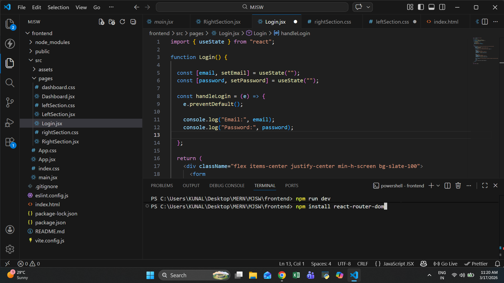
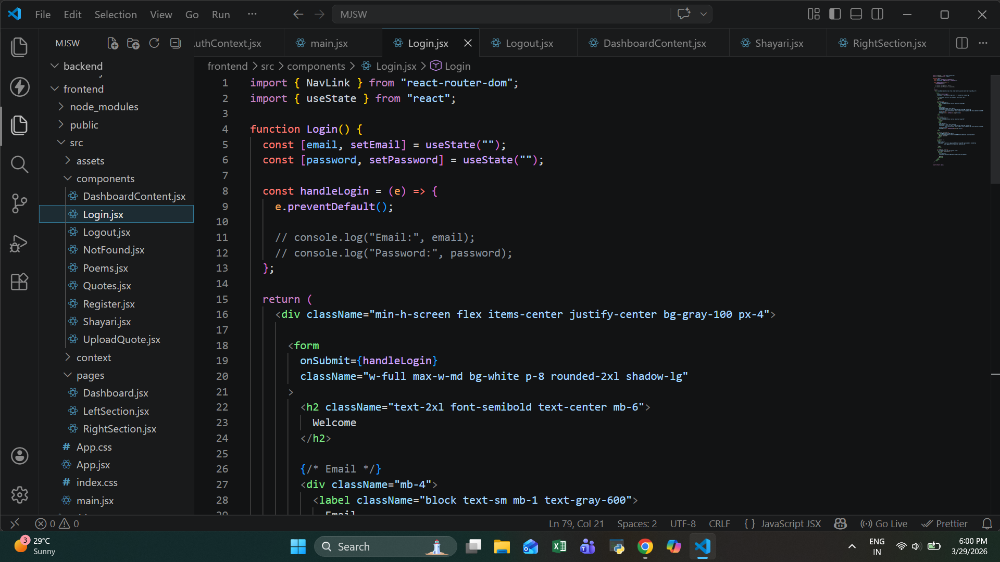
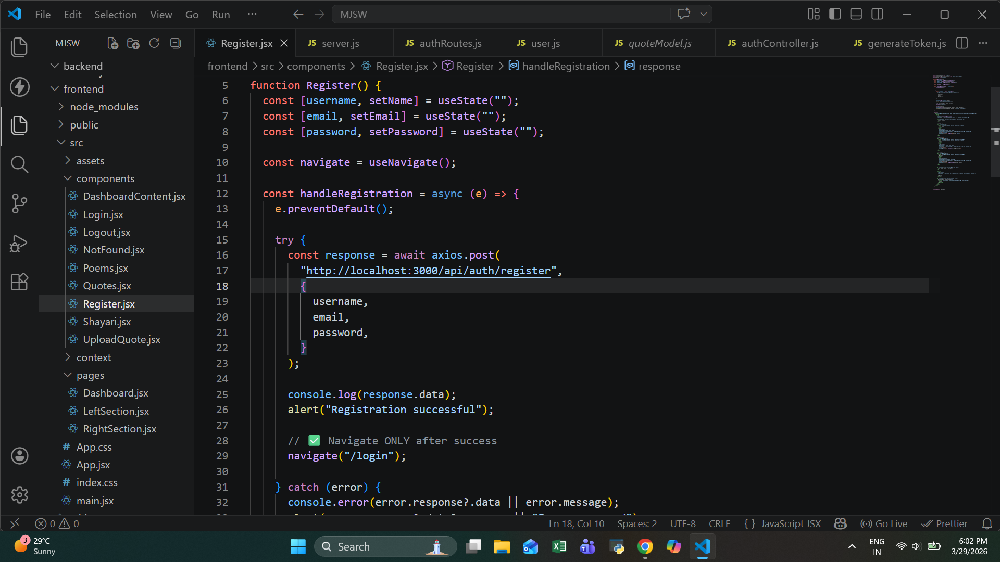
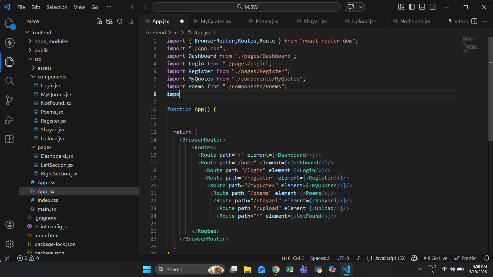
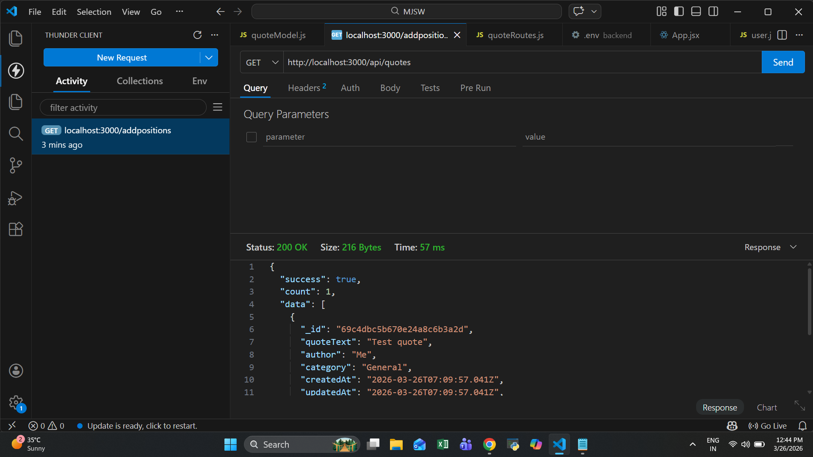

# 🌐 MyJustSimpleWords

🔗 **Live Demo:** https://myjustsimplewords.vercel.app/

## 📌 About

MyJustSimpleWords is a full-stack MERN web application where users can create, share, and explore quotes, poems, and shayari.
It includes authentication, protected routes, and a chatbot assistant for user interaction.

## 🚀 Features

* 🔐 User Authentication (JWT + Cookies)
* ✍️ Create & Upload Quotes / Poems / Shayari
* 🔎 Search by Author
* 🤖 Chatbot Support
* 📱 Responsive Design
* 🎨 Modern UI with Tailwind CSS

---

## 🛠 Tech Stack

**Frontend:**
* React (Vite)
* Tailwind CSS
* Axios
* React Router

**Backend:**
* Node.js
* Express.js
* MongoDB Atlas
* JWT Authentication

---

## 📸 Screenshots

### 🏠 Homepage


### 📊 Dashboard


### ✍️ Writing Section


### 🔐 Login Page


### 📝 Registration Page


### 🧭 Routes Structure


### ⚡ API Testing (Thunder Client)
   

---

## 📁 Folder Structure

```
MJSW/
│
├── frontend/
│   ├── src/
│   │   ├── components/
│   │   ├── pages/
│   │   ├── context/
│   │   ├── hooks/
│   │   └── App.jsx
│   └── package.json
│
├── backend/
│   ├── config/
│   ├── models/
│   ├── routes/
│   ├── controllers/
│   ├── middleware/
│   └── server.js
```

---

## ⚙️ Setup Instructions

### 1️⃣ Clone the repository

```bash
git clone https://github.com/your-username/myjustsimplewords.git
cd myjustsimplewords
```

### 2️⃣ Install dependencies

Frontend:

```bash
cd frontend
npm install
npm run dev
```

Backend:

```bash
cd backend
npm install
node server.js
```

---

## 🔑 Environment Variables

Create `.env` in backend:

```
MONGO_URI=your_mongodb_url
JWT_SECRET=your_secret_key
```

Frontend `.env`:

```
VITE_API_URL=http://localhost:3000
```

---

## 🚀 Future Improvements

* ❤️ Like, Save & Share feature
* 🌐 Public profiles
* 🤖 AI-generated quotes

---

## 🙌 Author
Ranjana K. Chaudhary
